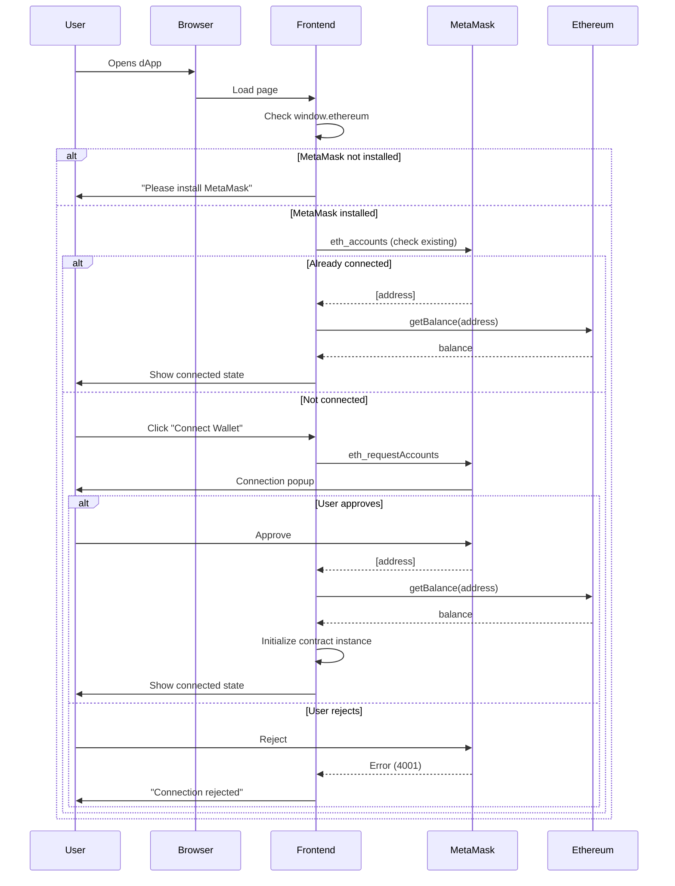
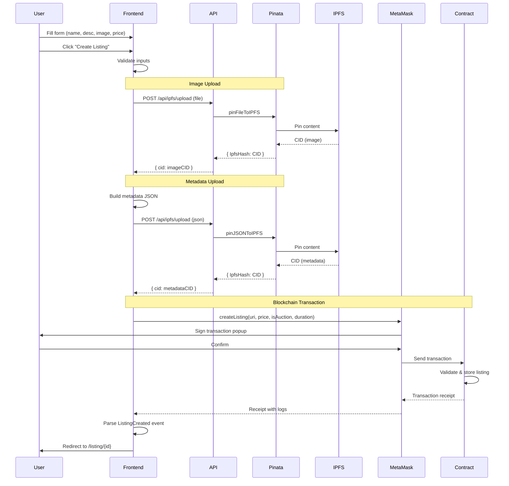
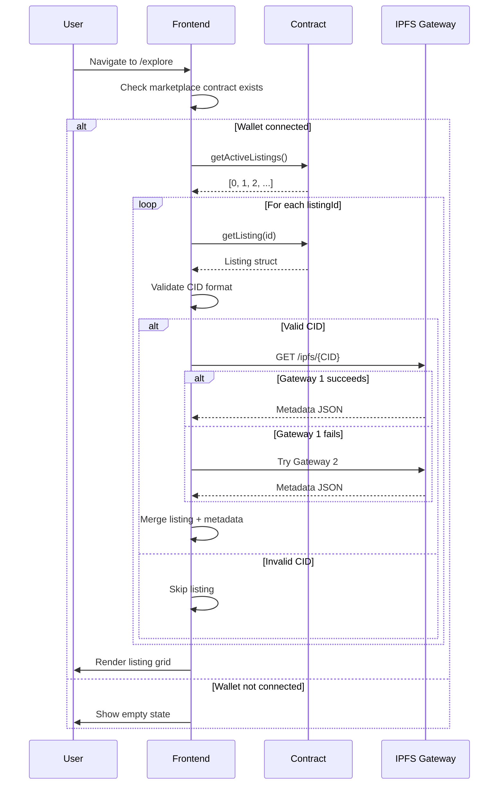
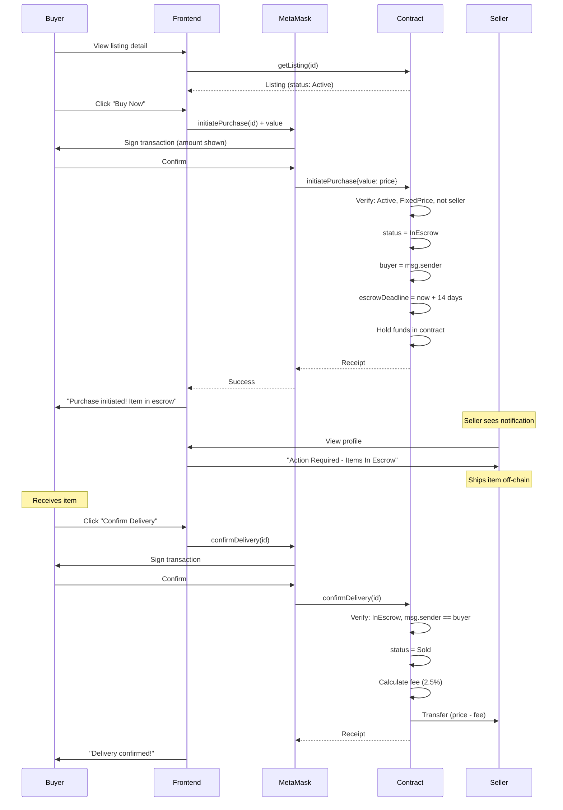
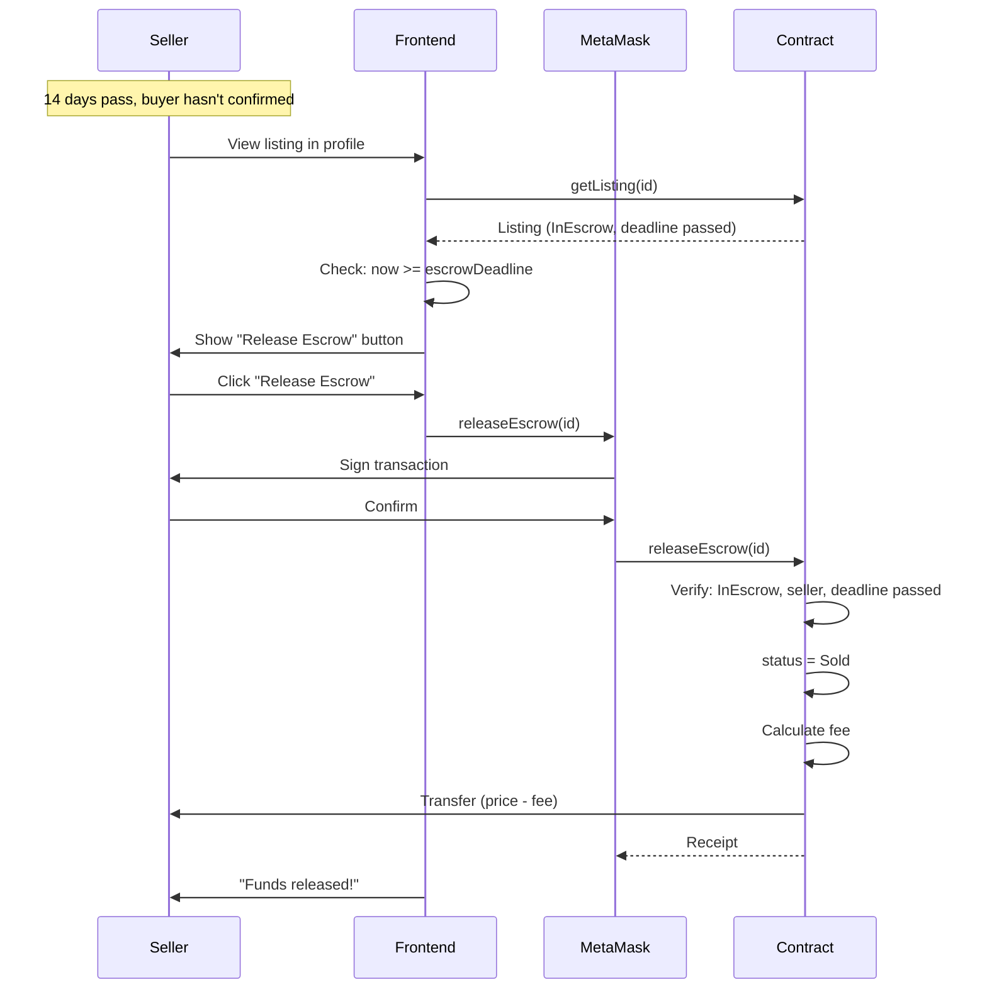
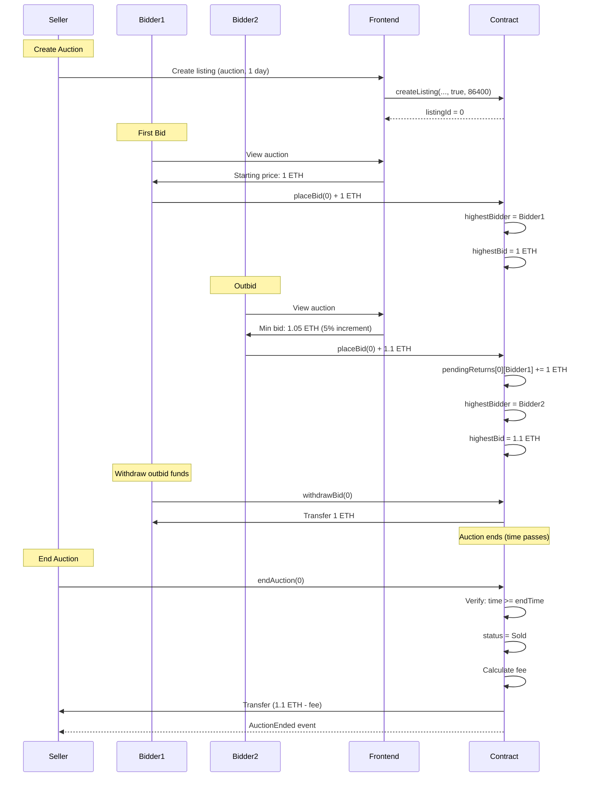

# Sequence Flows

## Purpose

Visualise the key user journeys with sequence diagrams.

## Scope

Covers wallet connection, listing creation, purchases, and auctions.

## Audience

Developers and anyone seeking to understand system interactions.

---

## 1. Wallet Connect / Authentication



---

## 2. Create Listing



---

## 3. Fetch Listings (Explore Page)



---

## 4. Purchase with Escrow



---

## 5. Escrow Release After Deadline



---

## 6. Auction Lifecycle



---

## 7. ASCII Diagrams (Alternative)

### Purchase Flow (ASCII)

```
Buyer          Frontend         MetaMask         Contract         Seller
  |               |                |                |                |
  | Click Buy     |                |                |                |
  |-------------->|                |                |                |
  |               | initiatePurchase               |                |
  |               |--------------->|                |                |
  |               |                | Sign request   |                |
  |               |<---------------|                |                |
  | Confirm       |                |                |                |
  |-------------->|                |                |                |
  |               |                | Send tx        |                |
  |               |                |--------------->|                |
  |               |                |                | Validate       |
  |               |                |                | Hold funds     |
  |               |                |                | status=InEscrow|
  |               |                |<---------------| Receipt        |
  |               |<---------------|                |                |
  | Success!      |                |                |                |
  |<--------------|                |                |                |
  |               |                |                |                |
  |               |                |                | Notification   |
  |               |                |                |--------------->|
  |               |                |                | "Ship item!"   |
```

---

## 8. Related Documentation

- [Requirements](01-requirements.md) — Functional requirements
- [System Architecture](02-system-architecture.md) — Component overview
- [API & Contracts](04-api-and-contracts.md) — Function details
