# Architecture Diagrams

Mermaid diagrams for DecentraMarket architecture.

---

## 1. System Architecture Overview

---

## 2. Data Flow Diagram

---

## 3. Create Listing Flow

---

## 4. Purchase with Escrow Flow

---

## 5. Auction Flow

---

## 6. Component Architecture

```mermaid
flowchart TB
    subgraph Pages["Pages (App Router)"]
        Home["/ (Home)"]
        Explore["/explore"]
        Create["/create"]
        Listing["/listing/[id]"]
        Profile["/profile"]
    end

    subgraph Components["Components"]
        Header["Header"]
        Footer["Footer"]
        ListingCard["ListingCard"]
        IpfsImage["IpfsImage"]
    end

    subgraph Contexts["Contexts"]
        WalletContext["WalletContext<br/>• address<br/>• isConnected<br/>• connect()"]
    end

    subgraph Hooks["Hooks"]
        useMarketplace["useMarketplace<br/>• marketplace contract<br/>• createListing()<br/>• initiatePurchase()<br/>• confirmDelivery()"]
    end

    subgraph Lib["Lib/Utils"]
        constants["constants.ts<br/>• CONTRACT_ADDRESS<br/>• CHAIN_ID"]
        ipfs["ipfs.ts<br/>• uploadFile()<br/>• fetchMetadata()"]
        contractABI["Marketplace.json"]
    end

    Pages --> Components
    Pages --> Contexts
    Pages --> Hooks
    
    Hooks --> Lib
    Components --> Lib
```

---

## 7. Smart Contract Structure

---

## 8. Trust Model Comparison

```mermaid
flowchart LR
    subgraph Traditional["Traditional Marketplace"]
        TBuyer["Buyer"] -->|"Pays"| TPlatform["Platform<br/>(eBay, Amazon)"]
        TPlatform -->|"Holds funds"| TPlatform
        TPlatform -->|"Releases"| TSeller["Seller"]
        
        TRisk["⚠️ Risk: Platform controls funds"]
    end

    subgraph Decentralised["DecentraMarket"]
        DBuyer["Buyer"] -->|"Pays"| DContract["Smart Contract<br/>(Code)"]
        DContract -->|"Holds in escrow"| DContract
        DContract -->|"Auto-releases"| DSeller["Seller"]
        
        DSafe["✅ Safe: Code controls funds"]
    end
```

---

## 9. Deployment Architecture

---

## Usage

### In Markdown (GitHub)
GitHub renders Mermaid natively. Just paste the code blocks.

### In PowerPoint
1. Go to [mermaid.live](https://mermaid.live)
2. Paste diagram code
3. Export as PNG/SVG
4. Insert into slide

### In Notion
Notion supports Mermaid in code blocks with `mermaid` language tag.
